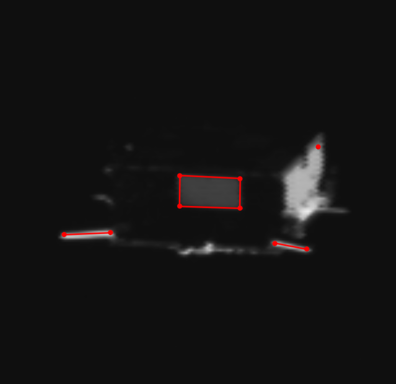
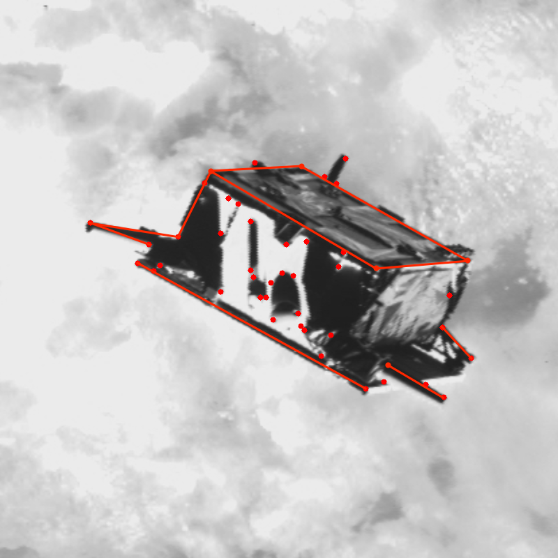
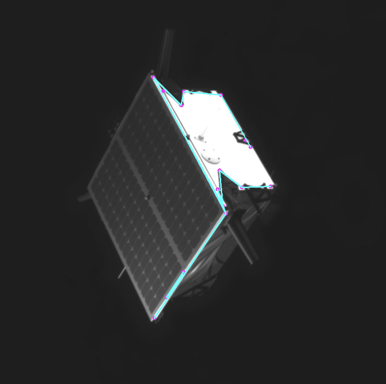
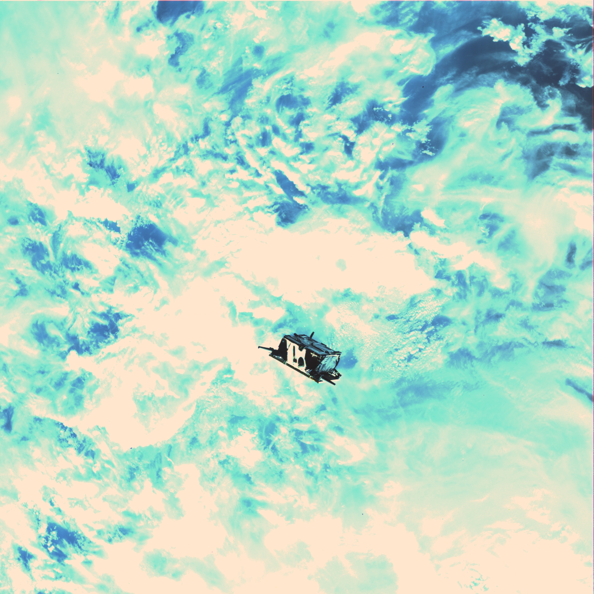
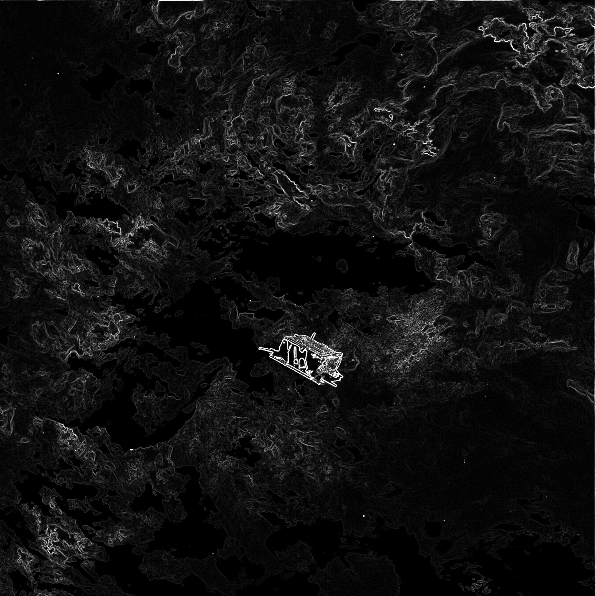
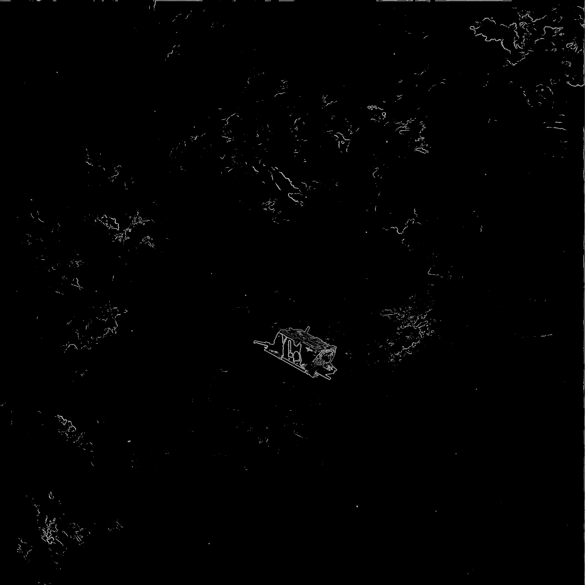
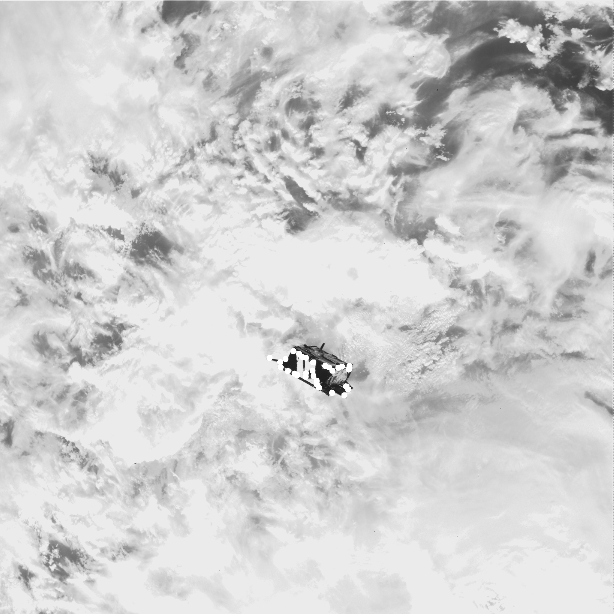
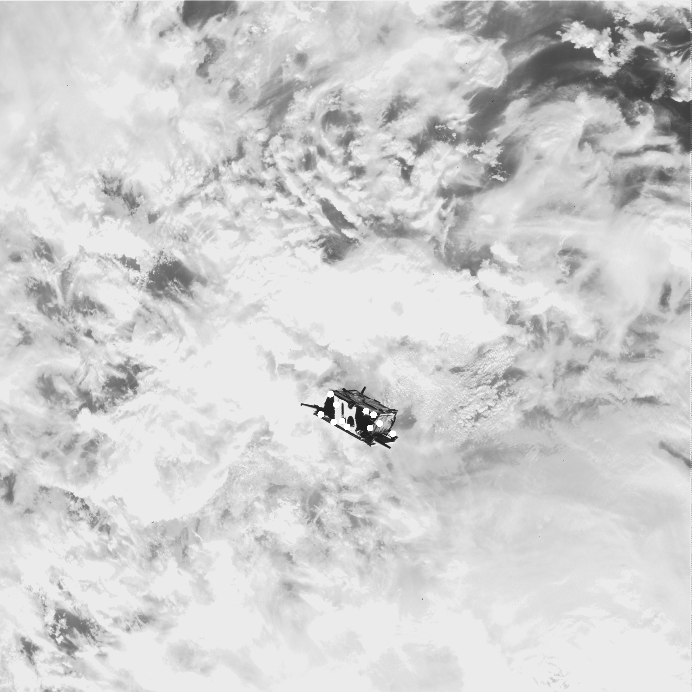
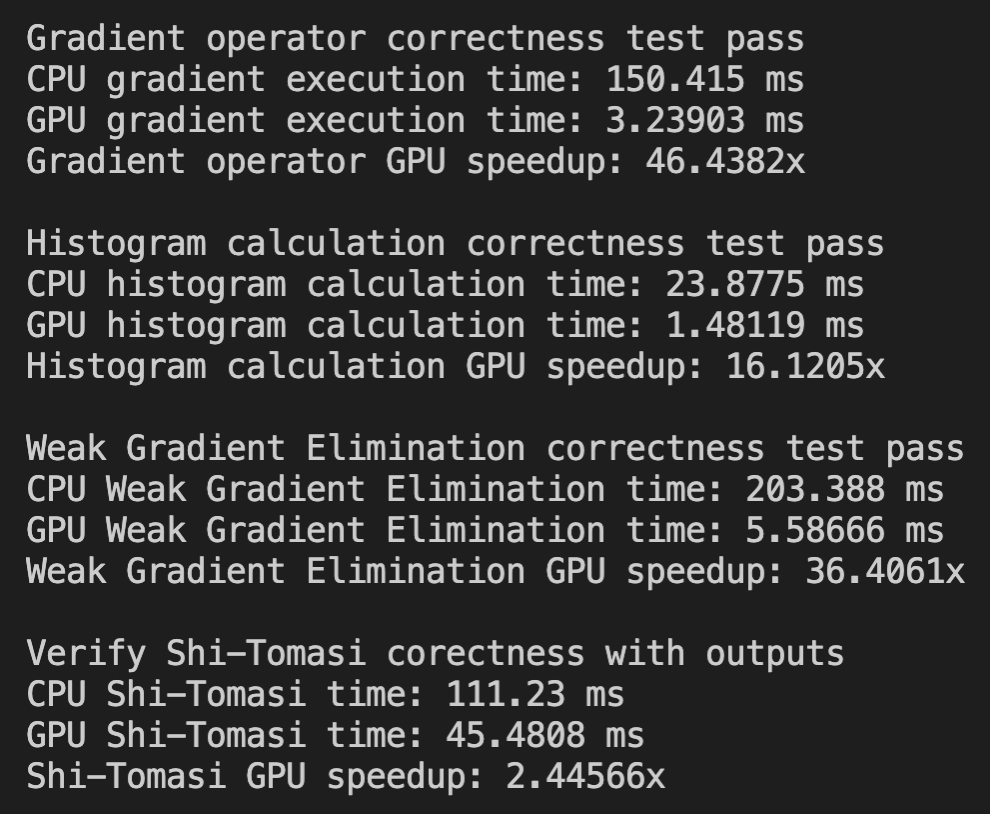

# Project Proposal

## Group Members
Andrew Ho and Grace Lu

## Introduction

In 2018, Caltech researchers Andrew Ho, Vincenzo Capuano, and Ryan Alimo published a technical paper on a feature extraction algorithm created by Andrew Ho for real-time onboard pose acquisition without communication with ground observatories, called Polyline Detection. In order to begin tracking an object to follow its position, the positional information (pose), which includes location and orientation, the most significant features, namely edges and corners, needed to be extracted in order to perform SLAM. The algorithm designed by Andrew Ho first uses a process called Weak Gradient Elimination (WGE) to remove background noise and acquire the region of interest and then utilizes three different feature extraction techniques that each produce a set of candidate features and whose advantages neutralize the disadvantages of the other techniques: Hough Line Transform (HLT), Line Segment Detection (LSD), and Shi-Tomasi Corner Detection (STCD). Using these features, points are filtered on their viability using proximity heuristics, and combined using embededed vector information. 

  

While the paper speaks about potential parallelization with regards to performing the three feature extraction techniques, the initial implementation does not actually utilize said parallelization. In addition, the actual implementation of many of these algorithms were used out of the box in OpenCV,  which are not optimized using GPU programming. 

## Features Included

The features that this project offers are as follows:

1. Greyscale image gradient approximation
2. Greyscale image pixel value histogram calculation
3. Weak Gradient Elimination
4. Shi-Tomasi Corner detection

## Implementation Details and Expected Results

The below examples were produced using the following image:

### Greyscale Image Gradient Approximation

Gradients of images are often used in feature extraction, as they provide pixel change information that is useful for detecting corners or straight lines. Exact gradients of images are impossible to calculate, since we would need the exact differentiable function that would have produced the image. As such, gradient approximation strategies using convolution filters are employed instead, namely the Sobel and Prewitt filters. Each pixel is convoluted with either a horizontal or vertical gradient filter, producing vertical, horizontal, and composite gradient approximations. Users input a source image and the proximity term that denotes the weight in the convolution filter given to directly neighboring pixels, as well as the gradient direction to calculate.

Our CPU version maintains a destination image that keeps the results of the convolutions in the source image, and serially iterates over all the pixels in the image, calculating the resulting convolutions.

Our GPU version has one thread calculate the convolution of a single pixel in the image. This parallelizes the convolutional operation significantly. Gradient are capped at a maximum value of 256.

### Greyscale Image Pixel Value Histogram Calculation

Histograms are often used to analyze and manipulate the distribution of pixel values in an image. In our use-case, we wish to find the kth percentile pixel value for WGE. Users input an image and are returned an array of size 256 for unsigned integers with the counts of each pixel value. The size is 256 since there are 256 possible greyscale pixel values.

Our CPU version simply iterates over all the pixels and accumulates them serially into a single histogram.

Our GPU version uses shared memory concepts in order to build up a single pixel value histogram. The kernel uses an array of size 256 to mimic the global histogram. First, each thread in a block is responsible for clearing the shared memory, reseting the counters to zero. The threads are then synced, resulting in the shared memory being perfectly reset for the next step. Each thread then retrieves a single pixel value and increments that slot in the shared memory histogram. The threads are then synced again, resulting in a histogram for a single sub-square of the image. Finally, the first 256 threads of every block will atomically write their slot to the global histogram. 

### Weak Gradient Elimination

Weak gradient elimination finds the kth percentile gradient value and removes all pixels that have gradient values lower than that threshold. This kernel is not very complex, and combines the results from the gradient approximation operator and the histogram calculator. Users input a source image, a pixel percentile, and a proximity term to be used in the image gradient calculation

Our CPU version simply iterates over all pixels, zeroing out any pixels with a gradient below our calculated threshold.

 

Our GPU version has a single thread check and zero out a single pixel.

### Shi-Tomasi Corner Detection

Shi-Tomasi Corner Detection has the following steps:

1. Calculate the two eigenvalues of each 3x3 window around each pixel
2. Sort pixels by their smaller eigenvalue
3. For each pixel with an eigenvalue is larger than a certain threshold, check if there is a strong feature already accepted within a certain distance threshold. If there isn't, then add the current pixel to feature buffer

Users can input a max number of features to detect as well.

The CPU version uses OpenCV's built-in Shi-Tomasi corner detector. The base implementation will serially iterate over all the pixels in the image and calculate the eigenvalues of the 3x3 window around each pixel. The eigenvalues are then sorted in an static array and the feature buffer is filled.

Our GPU version calculates eigenvalues in a parallel manner, with each thread calculating the eigenvalues of that pixel's 3x3 square. The eigenvalues are then stored in an array of structs called eigenvalue_data_t, of size N, where N is the number of pixels in the array. Each struct holds the smaller eigenvalue of the pixel, as well as the x and y coordinates of the pixel. The GPU pointer to the eigenvalue array is then sorted using the thrust library and then copied back to the CPU, where the feature buffer is filled.

## Usage

### Package Set-Up

This project uses OpenCV heavily. On Linux, the set up can be done very easily
following the steps on this webpage:

https://docs.opencv.org/master/d7/d9f/tutorial_linux_install.html

If using this on Andrew Ho's titan.caltech.edu account, then OpenCV is
already installed.

### General Usage

The code to run the four techniques is found in the polyline_cpu.cpp and polyline_gpu.cu folders. The main exectuable to run the code can be made with the command, "make all", which will link the C++ and CUDA source files to the main.cpp file. Within the main.cpp file, users can change the input image name to test the code out on different images. All images must be put into the "images/input" directory. All output images will be written to the "images/output" directory. Running the command "make clean" will remove all object files and the main executable, as well as remove all output images from the output directory.

Currently, running the main executable will test the speed and correctness of all four techniques. Speed is measured in milliseconds. Correctness for the gradient operator, histogram calculation, and weak gradient elimination are tested with the self-implemented versions, and therefore can be exactly examined pixel by pixel for correctness. However, our in-house implementation of Shi-Tomasi was magnitudes slower than the OpenCV implementations, so in order to properly benchmark speed improvement of our implementation, we used the OpenCV implementation. This means correctness of our Shi-Tomasi implementation has to be verified with human eyes and judgement. The correctness test for Shi-Tomasi instead saves the two sets of corners by drawing them as white circles onto the original greyscale source image and saving them in the output folder.

### API Functions

Below are the functions visible to users in header files:

#### CPU

vector\<Point2f\> ST_corner_detection(Mat input, int maxCorners)

Mat gradient_operator(Mat src_img, int proximity_term, int mode)

Mat WGE(cv::Mat src_img, int proximity_term, float percentile)

unsigned int* calculate_histogram(cv::Mat src_img)
 
#### GPU
 
cv::Mat cuda_call_gradient_kernel(cv::Mat src_img, int proximity_term, GradientDirection mode, unsigned int thread_dim);

unsigned int* cuda_call_hist_kernel(cv::Mat src_img, unsigned int thread_dim);

cv::Mat cuda_call_WGE_kernel(cv::Mat src_img, int proximity_term, float percentile, unsigned int thread_dim);
 
std::vector\<cv::Point2f\> cuda_call_ST_kernel(cv::Mat src_img, float eig_threshold, float dist_threshold, unsigned int max_features, int proximity_term, unsigned int thread_dim);
 
#### Testing
 
void test_gradient_operator_correctness(cv::Mat src_grey, string image_name, string output_path, bool save_imgs)

void test_gradient_operator_speed(cv::Mat src_grey)

void test_histogram_calculation_correctness(cv::Mat src_grey)

void test_histogram_calculation_speed(cv::Mat src_grey)

void test_WGE_correctness(cv::Mat src_grey, string image_name, string output_path, bool save_imgs)

void test_WGE_speed(cv::Mat src_grey)

void test_ST_correctness(cv::Mat src_grey, string image_name, string output_path, bool save_imgs)

void test_ST_speed(cv::Mat src_grey);
 
## Performance Analysis

The results from our speed test are as follows:

As our speed tests show, our GPU implementations are able to improve all 4 techniques considerably.

## Possible Improvements

Both gradient approximation and Shi-Tomasi Corner detection compute values based on a window around a pixel. Accessing these values requires dipping into global memory, which can be very slow. A possible improvement to make is to have each block load each pixel value into shared memory in the form of an array of the same image size, only flattened. Pixel values within the square would be easily reachable through shared memory, and values outside the square on the edges would be retrieved in global memory, reducing the amount of global memory accesses by a lot.
